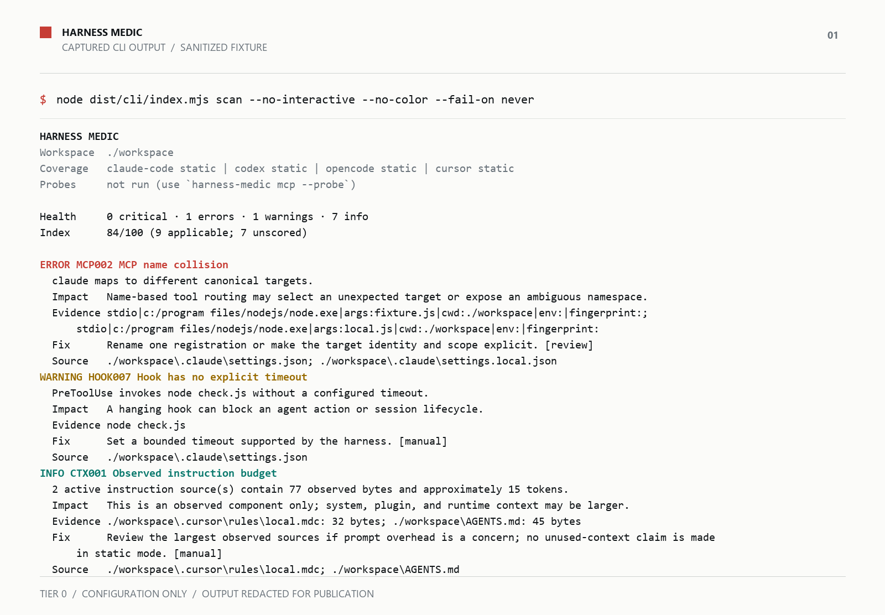
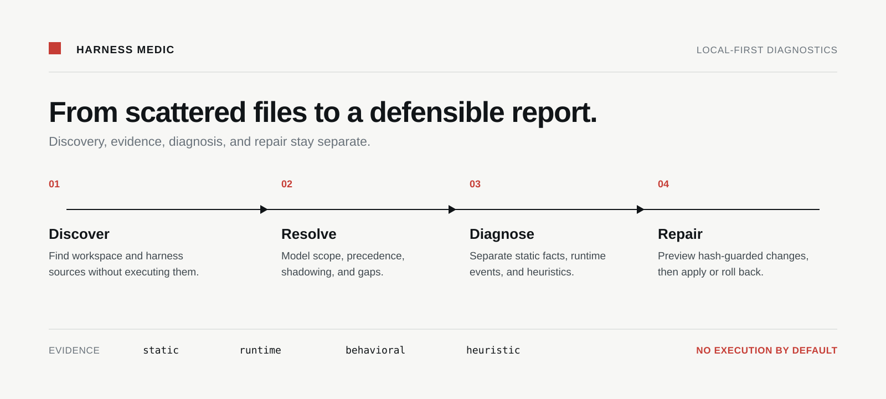

# Harness Medic

> Inspect what your coding harness loads before it acts.

[](https://nodejs.org/)
[](LICENSE)
[](docs/privacy.md)

Harness Medic reconstructs the effective configuration for Claude Code, Codex, OpenCode, and Cursor in one workspace. It shows what loaded, what it costs, what looks unsafe, and what you can change without guessing.

It runs locally, preserves source provenance, and never uploads configuration.

<p align="center">
  
</p>

The image is a rendered capture of a real `scan` run against committed synthetic fixture data. Paths are redacted for publication; findings and labels come from the CLI.

## How it works

The flow stays linear: discover sources, resolve precedence, diagnose with evidence, and repair through a reviewed plan.

<p align="center">
  
</p>

## What you get

Harness Medic turns scattered harness files into one evidence-labelled report:

- **Effective environment**: discover sources, scopes, precedence, shadowing, and malformed input
- **Observed context budget**: count captured instruction bytes and estimate tokens without claiming a universal context total
- **MCP and hook diagnostics**: identify collisions, metadata risks, capability exposure, invalid shapes, and missing timeouts
- **Reviewable remediation**: preview parser-aware changes, then apply transactional fixes with hash preconditions and rollback

## Start with a read-only scan

The default scan is Tier 0. It reads configuration and instruction files only. It does not execute configured hooks or MCP commands, contact remote servers, or send telemetry.

```sh
npx harness-medic scan --no-interactive
```

The terminal report is for people. The JSON report is a versioned machine contract, and diagnostics stay on stderr:

```sh
npx harness-medic scan \
  --format json \
  --no-interactive \
  --fail-on never \
  --output report.json
```

Use `--cwd` and `--home` to scan an isolated fixture or a workspace outside the current directory:

```sh
npx harness-medic scan \
  --cwd ./workspace_path \
  --home ./harness_home_path \
  --harness all \
  --no-interactive
```

Node.js 24 or newer is required. The package is ESM, and the executable is `harness-medic`.

## Read findings by evidence class

The report separates observed facts from runtime events and risk indicators:

| Evidence | Meaning |
|---|---|
| `static` | Parsed bytes, source path, precedence, and configuration state |
| `runtime` | An explicitly approved probe, protocol response, latency, or cleanup result |
| `behavioral` | A recorded transcript or isolated benchmark trial |
| `heuristic` | A named pattern with confidence and precision status; not proof of maliciousness |

Unobserved provider prompts, plugins, managed policy, and session state remain coverage gaps. Token estimates apply only to captured text.

## Choose a command for the task

| Command | Use it to |
|---|---|
| `scan` | Build the complete offline report |
| `context` | Inspect observed instructions and context budget |
| `rules` | Find instruction precedence, conflicts, references, and duplicates |
| `mcp` | Inspect MCP registrations, identities, schemas, and limits |
| `hooks` | Validate hook events, matchers, targets, executables, and timeouts |
| `security` | Review metadata, permissions, transports, launchers, and secret indicators |
| `fix` | Preview or apply parser-aware transactional fixes |
| `baseline` | Create or compare a local redacted snapshot |
| `benchmark` | Evaluate explicitly recorded adherence trials |
| `explain RULE_ID` | Read a rule’s evidence contract, references, and remediation |

Workspace-scoped commands accept common options such as `--cwd`, `--home`, `--harness`, `--format`, `--fail-on`, `--no-interactive`, `--verbose`, and `--no-score`.

## Probe only with explicit consent

MCP probing is separate from the default scan. It attempts initialization and `tools/list`; it never calls a tool. In non-interactive mode, name each server you approve:

```sh
npx harness-medic mcp \
  --probe \
  --no-interactive \
  --allow-server server_name
```

Remote transports also require `--allow-network`. Third-party or unknown-trust servers additionally require `--allow-untrusted`. Probe timeouts, retries, cancellation, and child-process cleanup are bounded.

Hook probing is also opt-in. The current safe path reports probe capability and does not execute configured hook commands.

## Fixes stay reviewable

Start with a preview. Harness Medic uses content-hash preconditions, parser-aware edits, backups, post-write reconstruction, and whole-plan rollback:

```sh
npx harness-medic fix --dry-run
npx harness-medic fix --safe --apply
```

Review the plan before applying it. User-scope changes require explicit selection. Fixes never auto-enable registrations, and the CLI applies changes only from an explicit selection or safe plan.

## Supported harnesses

Harness Medic models four harness-specific source and precedence contracts. “Modeled” means the adapter understands the source shape and precedence; it does not mean every runtime-owned component is visible.

| Harness | Static reconstruction | Optional runtime path |
|---|---|---|
| Claude Code | Settings, `CLAUDE.md`, MCP, hooks | Approved MCP startup and `tools/list` |
| Codex | `config.toml`, `AGENTS.md`, MCP, hooks | Approved MCP startup and `tools/list` |
| OpenCode | Settings, rules, MCP, hooks | Approved MCP startup and `tools/list` |
| Cursor | MCP, rules, hooks where present | Approved MCP startup and `tools/list` |

See the [compatibility matrix](docs/compatibility.md) for source scope, coverage dimensions, platform behavior, and known gaps.

## Learn the report and support model

- [Privacy model](docs/privacy.md): redaction boundaries, execution tiers, and local artifacts
- [Threat model](docs/threat-model.md): protected assets, threats, controls, and non-goals
- [Rule reference](docs/rule-reference/index.md): live rule IDs, evidence classes, severity, and fix safety
- [Fixture guide](docs/contributing-fixtures.md): synthetic compatibility and security cases
- [Example report](examples/reports/minimal.json): schema-valid sanitized JSON
- [Contributor guide](CONTRIBUTING.md): development workflow and contribution boundaries
- [Security policy](SECURITY.md): private vulnerability reporting
- [Publishing guide](docs/publishing.md): repository metadata, topics, social preview, and launch checklist

## Run from source

The repository targets Node.js 24 or newer and uses npm with a committed lockfile:

```sh
npm ci
npm run build
node dist/cli/index.mjs scan --no-interactive
```

Run the full local gate before opening a pull request:

```sh
npm run typecheck
npm test
npm run lint
npm run build
npm run pack:check
npm run test:security
npm run corpus:report
npm run benchmark:scan
npm run release:validate
```

Fixtures live under `tests/fixtures`. Keep values synthetic, preserve expected-negative cases, and never run destructive hooks or real MCP servers while building a fixture. Start with [CONTRIBUTING.md](CONTRIBUTING.md) and [the fixture guide](docs/contributing-fixtures.md).

## License

MIT. Dependency notices are recorded in [NOTICE](NOTICE).