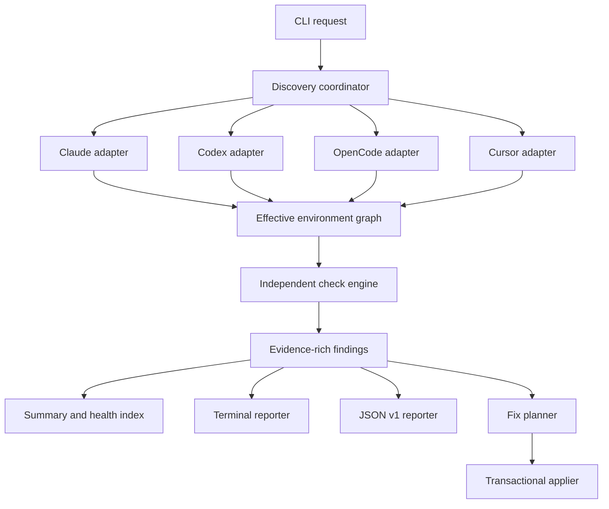
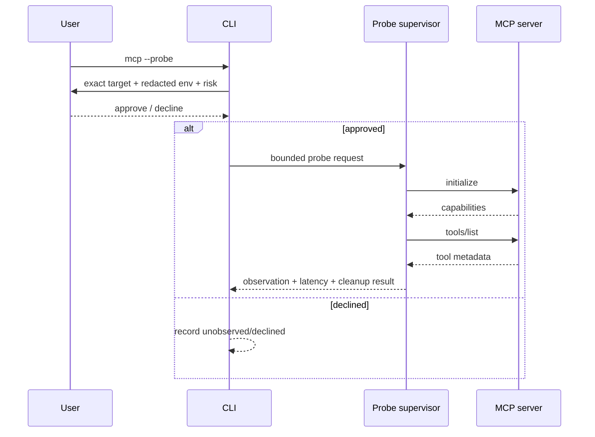
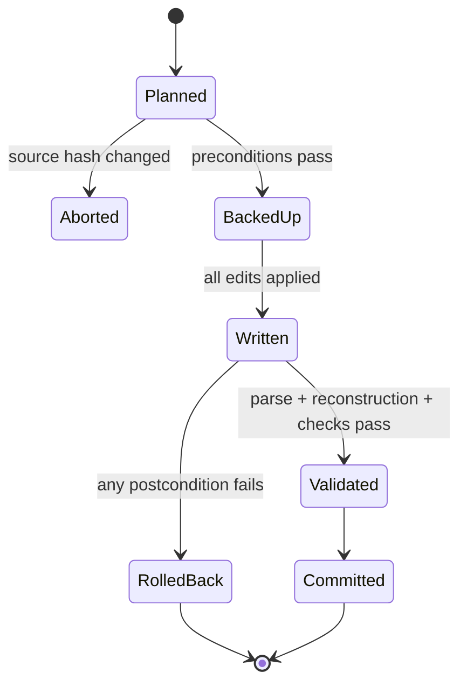
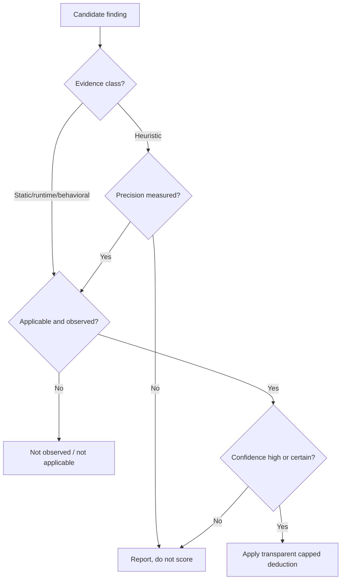

# Harness Medic Cross-Harness Diagnostics - Plan

## Goal Capsule

- **Objective:** ship a local-first CLI that reconstructs the effective Claude Code, Codex, OpenCode, and Cursor harness for one workspace, quantifies its context/tool overhead, diagnoses rule, MCP, hook, and security failures with evidence, and supplies safe human- and agent-consumable remedies.
- **Authority:** deterministic adapter output and runtime observations outrank heuristics; official harness documentation outranks inferred precedence; security findings disclose confidence and never claim compromise from suspicious text alone.
- **Execution profile:** implement the offline static scan first, then consent-gated active probes, then transcript-backed behavioral benchmarking.
- **Stop conditions:** do not ship a harness as supported until its fixtures prove discovery, merge precedence, provenance, and malformed-input handling on Windows, macOS, and Linux path models.
- **Tail ownership:** release only after fixture corpus, real CLI smoke runs, JSON schema compatibility, documentation, licenses, and package dry-run pass.

---

## Product Contract

### Summary

Harness Medic is the diagnostic layer above coding-agent configuration, not another repository-readiness linter or generic security scanner. Its primary answer is: **what will this harness actually load for this workspace, how much does it cost, what is broken, and what can be changed safely?**

The public brand and binary should be `Harness Medic` / `harness-medic`. The unscoped npm name returned 404 and the GitHub exact-name search found no direct `harness-medic` project. `Harness Doctor` is already occupied by the active `@andypai/harness-doctor` package, while `agent-doctor` is an active direct competitor with the same broad diagnostic promise.

### Problem Frame

Coding harness state is fragmented across user, project, local, managed, plugin, CLI, and runtime sources. Flat file scans misdiagnose templates as active configuration, miss override behavior, double-count equivalent MCP servers, and cannot distinguish configured behavior from observed behavior. Native doctor commands expose only slices: on the inspected workstation, `claude doctor` focused on installation/config validity, while the three native MCP list commands disagreed because each harness had its own active configuration.

The problem set is verified by recent reports and current documentation:

- OpenCode reports full MCP schemas contributing roughly 18k tokens per prompt and a provider request containing 520 tools against a 200-tool limit ([#29986](https://github.com/anomalyco/opencode/issues/29986), [#20500](https://github.com/anomalyco/opencode/issues/20500)). These are incident reports, not universal baselines.
- Claude Code reports duplicate plugin MCP registration, duplicate namespaces, first-turn tool absence during slow startup, terminal attach failures without retry, invalid hook matchers disabling hooks, stale same-named hook resolution, and duplicate subagent actions ([#26139](https://github.com/anthropics/claude-code/issues/26139), [#33745](https://github.com/anthropics/claude-code/issues/33745), [#76239](https://github.com/anthropics/claude-code/issues/76239), [#84778](https://github.com/anthropics/claude-code/issues/84778), [#75071](https://github.com/anthropics/claude-code/issues/75071), [#83952](https://github.com/anthropics/claude-code/issues/83952), [#22658](https://github.com/anthropics/claude-code/issues/22658)).
- Codex reports repository validation rules losing to injected runtime instructions, loaded `AGENTS.md` rules being ignored, inconsistency later in long sessions, and insufficient subagent instruction control ([#25515](https://github.com/openai/codex/issues/25515), [#34189](https://github.com/openai/codex/issues/34189), [#25884](https://github.com/openai/codex/issues/25884), [#26806](https://github.com/openai/codex/issues/26806)).
- MCP metadata is an untrusted input surface. The MCP specification says clients should treat tool annotations as untrusted unless the server is trusted; OWASP documents tool poisoning; benchmark studies demonstrate successful metadata attacks but vary sharply by threat model ([MCP tools specification](https://modelcontextprotocol.io/specification/2025-11-25/server/tools), [OWASP MCP Tool Poisoning](https://owasp.org/www-community/attacks/MCP_Tool_Poisoning), [MCP-ITP](https://arxiv.org/abs/2508.14925), [MCPTox](https://arxiv.org/abs/2605.24069), [client vulnerability study](https://arxiv.org/abs/2603.22489)).

### Actors

- A1. A developer wants one readable diagnosis and exact evidence without uploading private configs.
- A2. A coding agent needs stable JSON, finding IDs, provenance, and deterministic exit codes rather than prose scraping.
- A3. A maintainer needs adapter fixtures and a compatibility matrix so harness drift is visible instead of silently producing wrong results.
- A4. A security reviewer needs trust boundaries, execution consent, redaction, schema-drift history, and confidence labels.

### Requirements

**Effective environment and evidence**

- R1. Discover all supported harness sources applicable to the selected workspace and preserve source scope, path, parser status, and precedence provenance.
- R2. Normalize sources into an effective-environment graph without losing harness-specific semantics or pretending unknown precedence is known.
- R3. Label every result as `static`, `runtime`, `behavioral`, or `heuristic`, plus confidence and observation status.
- R4. Degrade per source and per harness: one malformed or unavailable source must not erase valid results from other sources.

**Context and instructions**

- R5. Report exact bytes and token estimates for every observable instruction and MCP tool-schema component, with tokenizer identity and an explicit unobserved-context bucket.
- R6. Detect identical and near-identical instruction duplication, stale path/command references, unreachable imports, shadowed files, and high-confidence contradictory directives with source spans.
- R7. Never advertise an exact full initial-context total unless a harness-native export or transcript exposes every counted component.
- R8. Measure rule adherence only through explicit benchmark/transcript modes; static scans may identify risks but may not claim that an agent forgot a rule.

**MCP and tools**

- R9. Detect exact duplicate registrations by canonical launch/endpoint identity separately from same-name/different-target collisions and overlapping tool sets.
- R10. Count effective tools per harness/provider and flag only documented, configured, or user-supplied limits; unknown limits remain unknown.
- R11. With explicit consent, initialize MCP servers, list capabilities and tools, measure startup/list latency, retry transient failures, and terminate child processes reliably.
- R12. Snapshot normalized tool metadata with secrets redacted and detect later name, description, input-schema, output-schema, annotation, and instruction drift.
- R13. Attribute parent/child tool differences and duplicate side effects only when runtime evidence exists; static configuration can report exposure, not execution.

**Hooks and security**

- R14. Validate hook event names, matcher shape, command resolution, target identity, executable/runtime availability, timeout policy, and fail-open patterns without executing hooks during the default scan.
- R15. Offer synthetic hook firing only through a harness-native or explicitly approved sandbox path; never replay a real destructive event as a test.
- R16. Detect suspicious metadata directives, tool-name shadowing, broad or destructive capabilities, sensitive parameter additions, risky remote transports, unpinned stdio package launches, and dangerous permission/hook combinations.
- R17. Phrase metadata pattern matches as risk indicators, not proof of maliciousness; show matched evidence, threat preconditions, and confidence.

**Usability and automation**

- R18. One default command must finish offline, avoid prompts in non-TTY contexts, produce a prioritized terminal report, and preserve a stable versioned JSON contract.
- R19. Every finding must contain a stable rule ID, severity, doctor, summary, evidence, source locations, confidence, impact, remediation, fix safety, and relevant references.
- R20. Autofix must be transactional: preview first, back up touched files, preserve comments/format where supported, validate the reconstructed environment, and roll back the whole plan on failure.
- R21. Manual fixes must be copyable; agent-facing output must contain structured preconditions and patch intent rather than vague advice.
- R22. The CLI must run on supported Node releases on Windows, macOS, and Linux, and handle spaces, non-ASCII paths, CRLF, PATHEXT, symlinks, and platform path case rules.

### Key Flows

- F1. **Static diagnosis:** A1 runs `harness-medic`; adapters discover and parse sources; the engine reconstructs effective state; checks emit evidence; terminal output ranks actionable findings without executing configured code.
- F2. **Agent/CI diagnosis:** A2 runs `harness-medic --format json --no-interactive`; stdout contains only schema-valid JSON, diagnostics go to stderr, and exit status follows the selected failure threshold.
- F3. **Active MCP diagnosis:** A1 runs `harness-medic mcp --probe`; the CLI displays exact commands/URLs with redacted environment values, obtains per-server consent in a TTY, probes approved servers with bounded retries/timeouts, and records declined servers as unobserved.
- F4. **Safe remediation:** A1 runs `harness-medic fix --dry-run`, reviews a patch plan, applies selected safe fixes, then the engine re-parses and re-runs affected checks before commit or rollback.
- F5. **Behavior benchmark:** A1 runs `harness-medic benchmark` after installing an explicit benchmark pack; isolated workspaces execute harmless canary tasks across fresh, long, compacted, and subagent modes where supported; the report shows observed adherence rates and sample counts, not model guarantees.

### Acceptance Examples

- AE1. Two server names that resolve to the same `command + args + cwd + redacted env-key set` are reported as one duplicate group; equal names pointing at different URLs are reported as a collision, not a duplicate.
- AE2. A project `AGENTS.md` saying “always run tests” and a higher-precedence runtime instruction saying “do not validate unless asked” produce a sourced conflict only when both are active in the same reconstructed environment; a stale template copy does not.
- AE3. A configured stdio server is not spawned by the default command. In `mcp --probe`, declining its consent yields `observation: declined`, no child process, no false failure, and no score penalty for unobserved runtime health.
- AE4. If a hook matcher is invalid, the finding names the event, matcher, source file, parser/validator rule, and potential blast radius. It does not claim the hook failed to fire unless a synthetic or transcript observation proves that.
- AE5. JSON output never contains raw config secrets or environment values. Redaction is structural before serialization and a fixture with canary secrets proves absence from stdout, stderr, snapshots, and error messages.
- AE6. If one Codex TOML source is malformed while Claude and OpenCode sources are valid, the report includes a Codex parse finding and still emits the other two effective environments.
- AE7. Applying a fix to a JSONC file preserves comments. If post-write parsing or reconstruction fails, all files regain their original bytes.

### Success Criteria

- Every MVP finding is reproducible from committed fixtures with byte-stable JSON snapshots.
- Default offline scan p95 is under 500 ms for the reference fixture corpus and under 2 seconds for a 10,000-file workspace on supported CI runners; active probes report their own duration and are excluded.
- Warm installation-to-first-report works with `npx harness-medic` on Windows, macOS, and Linux with no global dependency.
- The JSON schema is versioned from the first public release and rejects accidental secret-bearing fields.
- The project publishes a support matrix that distinguishes discovered, parsed, precedence-modeled, runtime-probed, and behavior-observed coverage for every harness.
- Security and conflict corpora record expected positives and expected negatives; precision is reported per heuristic rule before it is enabled by default.

### Scope Boundaries

**MVP (v0.1)**

- Claude Code, Codex, OpenCode, and Cursor adapters.
- Offline discovery, precedence reconstruction, context/instruction inventory, MCP duplication/tool counts, hook static validation where applicable, security indicators, versioned terminal/JSON output, and conservative transactional fixes.
- Active MCP probing behind explicit consent.

**Deferred for later**

- v0.2: transcript-backed usage, dead/unused capability evidence, MCP schema-drift snapshots, hook synthetic probes, and baseline/diff mode.
- v0.3: isolated adherence benchmark packs for fresh/long/compacted/subagent modes, with adapters exposing only harness capabilities they can prove.
- v0.4: additional harness adapters, plugin API, SARIF/GitHub Action, and optional integrations with specialist scanners.

**Outside this product's identity**

- A generic repository documentation/dead-code readiness linter; `@andypai/harness-doctor` already owns that layer.
- A full malware scanner or replacement for Snyk Agent Scan, AgentShield, Semgrep, or endpoint security.
- An LLM observability backend or transcript dashboard; HarnessScope and HarnessLens occupy that layer.
- Automatic deletion/disabling of MCP servers, rules, hooks, or permissions without a reviewed fix plan.
- Guaranteed universal context totals, universal provider tool limits, or deterministic semantic truth about natural-language rules.
- Cloud upload, telemetry, price-based monthly cost guesses, or model calls in default operation.

### Dependencies and Constraints

- Node.js 24 is the runtime floor. It is the current LTS line, satisfies Commander 15, Vitest 4, ESLint 10, and current tsdown releases, and avoids publishing against the older Node 22 maintenance line.
- MCP protocol behavior must use the official TypeScript SDK rather than a custom client.
- Harness formats drift. Each adapter declares the harness versions and source shapes its fixtures cover; unknown keys survive normalization as opaque evidence where possible.
- Managed/server-delivered policy can be undiscoverable from disk. Adapters must expose `coverageGaps` rather than infer its absence.

---

## Planning Contract

### Key Technical Decisions

- KTD1. **Name the project Harness Medic.** `Harness Doctor` and `agent-doctor` are occupied by active projects. `harness-medic` had no npm package and no direct GitHub exact-name collision when checked on 2026-08-28. Recheck immediately before publishing.
- KTD2. **Use a TypeScript ESM CLI on Node 24+.** Coding harness configuration, the official MCP SDK, and the intended npm/`npx` distribution all fit this stack; one language avoids a Python/Node bridge. Node 24 is the current LTS and satisfies the chosen current CLI/build/test tools.
- KTD3. **Model effective environments, not files.** Adapters own discovery and precedence; checks consume a normalized graph containing both active nodes and shadowed/invalid evidence.
- KTD4. **Make observations a first-class type.** `static`, `runtime`, `behavioral`, and `heuristic` findings cannot be collapsed into one certainty scale without misleading users.
- KTD5. **Use exact token accounting only for observed text.** `js-tiktoken` provides `o200k_base` and `cl100k_base` estimates; adapters select/report the estimator. Unknown harness-owned prompt components stay uncounted and visible.
- KTD6. **Default to zero execution and zero network.** Reading configuration is safe; spawning an MCP command or calling a remote server is not. Active probes require an explicit command and consent policy.
- KTD7. **Keep core findings deterministic.** Semantic contradiction detection starts with a small clause parser and opposite-polarity action/object pairs. Optional model-assisted analysis, if ever added, is a separate non-scoring plugin.
- KTD8. **Treat fixes as compare-and-swap transactions.** Each edit carries original content hash, parser-aware operations, postconditions, and rollback bytes; changed-on-disk input aborts before write.
- KTD9. **Use categorical health, not a pseudo-scientific universal grade.** The primary summary is counts and per-doctor status. An optional `healthIndex` is a transparent capped deduction over applicable high-confidence findings; unobserved checks do not pass or fail.
- KTD10. **Version machine contracts from day one.** JSON uses `schemaVersion: 1`; rule IDs and field meanings remain stable within the major schema version. Prose is not an automation interface.
- KTD11. **Keep dependencies boring and permissively licensed.** Runtime set: `commander`, `zod`, `jsonc-parser`, `yaml`, `smol-toml`, `fast-glob`, `ignore`, `js-tiktoken`, `picocolors`, and `@modelcontextprotocol/sdk`. Direct package/repository metadata identifies MIT, ISC, BSD-3-Clause, or the MCP SDK repository’s MIT/Apache transition; lockfile/license audit remains a release gate.
- KTD12. **Do not reuse competitors’ implementation as the architecture.** Competitor behavior informs product boundaries; implementation starts clean. Specialist security scanners may become opt-in integrations later rather than copied rule sets.

### Evidence Classes and Claim Rules

| Class | Required evidence | Allowed wording | Forbidden wording |
|---|---|---|---|
| `static` | Parsed bytes and source provenance | “is configured”, “resolves to”, “is shadowed” | “fired”, “was used”, “was forgotten” |
| `runtime` | Probe event, exit, protocol response, latency | “started in 2.1s”, “listTools failed twice” | “always unavailable” |
| `behavioral` | Transcript or isolated benchmark event | “observed in 7/10 trials” | “the model guarantees” |
| `heuristic` | Named rule, matched span, confidence, limits | “resembles a conflicting directive” | “is malicious”, “will conflict” |

Confidence is `certain`, `high`, `medium`, or `low`. `certain` requires direct parse/runtime evidence, not merely a strong regex. Every heuristic finding includes `precisionStatus: unmeasured | corpus-estimate | validated` and is excluded from the health index while unmeasured unless it protects against a critical secret/execution exposure.

### High-Level Technical Design

The following diagrams are directional architecture, not implementation syntax.









### Adapter Contract

Each adapter lives under `src/adapters/<harness>/` and implements the same behavior:

- `detect(context)`: determine installed/configured status without executing the harness.
- `discover(context)`: return candidate `ConfigSource` records with scope, priority, ownership, applicability, and discovery reason.
- `parse(source)`: validate and normalize one source while preserving diagnostics and opaque unknown fields.
- `resolve(parsedSources, context)`: construct the harness-specific effective environment, shadowing relationships, merge notes, and coverage gaps.
- `probeCapabilities()`: declare supported runtime operations (`mcpList`, `hookSynthetic`, `transcripts`, `compactionBenchmark`, `subagents`) without implying availability.
- `activeProbe(request, consent)`: optional, bounded, explicit execution path; unavailable capability returns `unsupported`, never a guessed result.

`resolve` is the adapter’s load-bearing function. The core does not merge arbitrary maps because Claude settings precedence, Codex instruction discovery, OpenCode deep-merge behavior, and Cursor rule modes are not interchangeable.

### Core Domain Model

```text
ScanContext
  cwd, home, platform, envNames, selectedHarnesses, scanTier, consentPolicy

ConfigSource
  id, harness, kind, scope, path, priority, applicable, ownership,
  contentHash, parser, parseStatus, diagnostics, discoveredBy

EffectiveEnvironment
  harness, adapterVersion, harnessVersion?, workspace,
  sources[], activeSourceIds[], shadowEdges[], coverageGaps[],
  instructions[], mcpServers[], tools[], hooks[], subagents[], permissions[]

InstructionDocument
  id, sourceId, path, scope, loadMode, active, bytes, tokenEstimates[],
  imports[], clauses[], sourceSpan

McpServer
  id, sourceId, configuredName, canonicalIdentity, transport,
  command?, args?, cwd?, url?, envKeyNames[], enabled, active, trust,
  toolInventory?, observation?

HookRegistration
  id, sourceId, event, matcher?, kind, target, resolvedTarget?, timeout?,
  active, validation[], observation?

Observation
  status: observed | failed | timed-out | declined | unsupported | not-run
  startedAt?, durationMs?, attempts, evidence[], cleanupStatus?

Finding
  id, ruleId, doctor, severity, evidenceClass, confidence,
  title, summary, impact, evidence[], locations[], remediation,
  references[], applicable, observed, scoreImpact, fixIds[]

FixPlan
  id, findingIds[], safety, operations[], preconditions[], postconditions[],
  affectedPaths[], preview
```

Secrets never enter normalized models as values. Environment maps become key names plus redacted fingerprints only when identity comparison requires them.

### Check Engine

A check is an independent object with metadata and a pure `run(environment, services)` operation. Metadata declares ID, doctor, default severity, required evidence, applicable harnesses, scan tier, score eligibility, references, and optional fixer. The coordinator runs checks in deterministic ID order after discovery/normalization, catches per-check failures as internal diagnostics, de-duplicates findings by `ruleId + normalized evidence identity`, and sorts output by severity, confidence, doctor, rule ID, then location.

Checks may request shared derived indexes—canonical MCP identities, instruction clause index, file-reference resolver, executable resolver, token estimator—but may not read process-global environment or filesystem directly. This keeps fixtures deterministic and lets agents add checks without knowing reporter or CLI code.

### Doctor Check Catalog

#### Context Doctor

- `CTX001 observed-instruction-budget`: inventory bytes/tokens by active source; warning thresholds are configurable and reported as policy, not scientific failure points.
- `CTX002 observed-tool-schema-budget`: count serialized MCP tool name/description/schema bytes and tokens per server when tool metadata is available.
- `CTX003 exact-instruction-duplicate`: normalized hash match across simultaneously active instruction documents.
- `CTX004 near-instruction-duplicate`: MinHash/Jaccard candidate followed by source-span confirmation; heuristic and non-scoring until corpus precision is measured.
- `CTX005 unobserved-context-components`: explicitly list system/runtime/plugin components the adapter cannot inspect so totals are not mislabeled complete.
- `CTX006 context-share`: only when a trusted total context-window setting is known; report numerator, denominator source, and estimate method.

No “unused context” recommendation is emitted without transcript or benchmark usage evidence. Static mode can say “largest observed component,” not “unnecessary.”

#### Rules Doctor

- `RULE001 invalid-instruction-source`: parse/read/import failure.
- `RULE002 shadowed-instruction-file`: discovered file does not apply or loses by documented precedence.
- `RULE003 stale-path-reference`: an instruction references a concrete local path that does not exist; ignore glob/examples/code fences according to parsed context.
- `RULE004 stale-command-reference`: exact package script, Make/just target, executable, or documented CLI reference is absent.
- `RULE005 high-confidence-conflict`: clause parser extracts the same action/object with opposite polarity and overlapping scope from active sources; report effective precedence separately.
- `RULE006 duplicate-clause`: identical normalized imperative across active documents.
- `RULE007 vague-or-unverifiable`: optional heuristic for “be good/careful/appropriate” style directives; info-only until validated.
- `RULE008 oversize-observed-source`: policy warning using bytes/tokens and source type; never equate size alone with model failure.
- `RULE009 benchmark-adherence-regression`: behavioral-only comparison with sample count and confidence interval.

The clause parser recognizes modality (`must`, `always`, `never`, `do not`, `unless`), action, object, condition, scope, and source span. It intentionally prefers false negatives over fabricated semantic conflicts.

#### MCP Doctor

- `MCP001 duplicate-registration`: same canonical transport identity active more than once.
- `MCP002 name-collision`: same exposed name maps to different canonical identities.
- `MCP003 duplicate-tool-name`: effective tool namespace contains colliding names.
- `MCP004 overlapping-toolset`: two servers expose materially overlapping normalized tool signatures; heuristic/info unless exact.
- `MCP005 tool-limit-exceeded`: effective count exceeds an explicit known limit; evidence names limit source.
- `MCP006 tool-limit-risk`: count approaches a configured limit; configurable threshold.
- `MCP007 executable-unresolved`: stdio command cannot be resolved with platform rules.
- `MCP008 environment-reference-missing`: required referenced variable absent; never print values.
- `MCP009 probe-startup-failed`, `MCP010 probe-startup-slow`, `MCP011 probe-list-failed`, `MCP012 transient-attach`: active-probe only, with attempt timeline.
- `MCP013 schema-drift`: baseline diff by normalized field; security escalation for new sensitive/destructive parameters.
- `MCP014 disabled-or-shadowed`: configured registration is not effective; info with precedence evidence.

Canonical stdio identity includes resolved executable, normalized args, cwd, and redacted environment-key/fingerprint set. Remote identity includes normalized URL, transport, and auth-header key names, never tokens.

#### Hooks Doctor

- `HOOK001 invalid-event`, `HOOK002 invalid-matcher`, `HOOK003 empty-match-domain`: static schema and matcher analysis.
- `HOOK004 target-unresolved`: command/interpreter/script resolution fails from the harness-defined working directory.
- `HOOK005 target-identity-collision`: expected path and resolved executable/script differ materially.
- `HOOK006 non-executable-target`: POSIX mode/interpreter or Windows extension/association prevents launch.
- `HOOK007 missing-timeout`, `HOOK008 fail-open-pattern`, `HOOK009 interactive-command`: risk checks grounded in exact command evidence.
- `HOOK010 synthetic-not-fired`, `HOOK011 runtime-failure`, `HOOK012 runtime-timeout`: runtime-only, supported harnesses only.

The static check never executes the command. The runtime verifier prefers a harness-native hook test/status interface; otherwise it uses a generated inert event and sandbox only after displaying the exact process tree. If no safe path exists, it reports `unsupported`.

#### Security Doctor

- `SEC001 metadata-instruction-pattern`: suspicious imperatives in server/tool descriptions, prompts, or server instructions; show matched span and classify as heuristic.
- `SEC002 cross-server-shadowing`: a less-trusted server’s tool name/description imitates a more-trusted capability.
- `SEC003 destructive-capability`: annotations/schema/name suggest write/delete/execute behavior; severity combines capability, trust, and approval policy.
- `SEC004 sensitive-parameter-addition`: schema drift adds credential, token, environment, filesystem-root, or network-target fields.
- `SEC005 broad-filesystem-scope`, `SEC006 shell-capability`, `SEC007 remote-untrusted-transport`, `SEC008 unpinned-package-launch`: deterministic configuration risks.
- `SEC009 auto-approval-dangerous-tool`: dangerous capability plus bypassed/automatic approval.
- `SEC010 hook-exfiltration-pattern`: command data flow combines sensitive source and network sink; source-aware heuristic, not a regex-only compromise claim.
- `SEC011 plaintext-secret`: structural secret detector; evidence is redacted and fix never invents an environment variable silently.
- `SEC012 rug-pull-drift`: previously approved metadata changed; active only with a local baseline.

Security output maps relevant findings to OWASP MCP categories and official MCP guidance but remains independent of any one taxonomy version.

### Transactional Fix Policy

Fix safety has three levels:

- `safe`: parser-preserving, semantics-local changes such as removing an exact duplicate entry from the lower-precedence source or correcting a provably stale path when one unique target exists.
- `review`: changes effective behavior, including disabling a server, editing a matcher, narrowing a permission, or deduplicating non-identical registrations. Previewable but never selected by `--safe`.
- `manual`: ambiguous semantic conflicts, hook rewrites, secret rotation, schema poisoning, and rule consolidation.

`harness-medic fix` defaults to dry-run in non-interactive contexts and requires `--apply` plus finding IDs or `--safe`. It writes no files outside the selected workspace unless the user explicitly selects a user-scope finding. Multi-file fixes use one transaction and one rollback journal under the OS temp directory; successful completion removes the journal.

### CLI Contract

```text
harness-medic [scan] [options]       offline full static scan (default)
harness-medic context               context/instruction view
harness-medic rules                 effective instructions and rule health
harness-medic mcp [--probe]          MCP config; optional consent-gated probes
harness-medic hooks [--probe]        hook config; optional safe probes
harness-medic security              local security indicators
harness-medic explain <RULE_ID>      rationale, evidence contract, references, fixes
harness-medic fix [ids...]           preview/apply transactional fixes
harness-medic baseline               create or compare redacted local snapshots (v0.2)
harness-medic benchmark              isolated behavioral benchmark packs (v0.3)
```

Common options: `--cwd`, `--harness`, `--format terminal|json`, `--output`, `--fail-on critical|error|warning|never`, `--no-score`, `--no-color`, `--verbose`, `--no-interactive`. `--probe` never follows from `--verbose` or a scan preset.

Exit codes:

- `0`: scan completed and no finding met `--fail-on`.
- `1`: one or more findings met `--fail-on`.
- `2`: invalid CLI usage or configuration.
- `3`: scan could not produce any supported effective environment.
- `4`: fix transaction failed and rollback completed.
- `5`: fix transaction failed and rollback could not be fully verified; terminal output names recovery files.

### Terminal and JSON Reporting

The terminal report leads with coverage, then actionable findings. It never hides skipped or unobserved runtime checks behind a green score.

```text
HARNESS MEDIC
Workspace  <path>
Coverage   Claude Code static | Codex static | OpenCode static | Cursor static
Probes     not run (use `harness-medic mcp --probe`)

Health     2 critical · 4 errors · 6 warnings · 3 info
Index      61/100 (12 applicable scored checks; 8 unscored heuristics)

CRITICAL MCP001 Duplicate registration
  Evidence duplicate canonical identity in user and project sources
  Impact   38 tools are exposed twice in this effective environment
  Fix      harness-medic fix fix-mcp-duplicate-github   [safe]
  Source   user MCP config; project MCP config
```

JSON top-level fields:

```text
schemaVersion, tool{name,version}, scan{id,startedAt,durationMs,tier},
workspace, privacy, coverage[], environments[], observations[], findings[],
summary{bySeverity,byDoctor,applicable,observed,unscored,healthIndex?},
fixPlans[], internalDiagnostics[]
```

Paths are absolute in local reports for usability but may be relativized with `--cwd` in portable output. JSON stdout contains only JSON. `--output` writes atomically.

### Health Index

The product does not use letter grades. Base is 100. Only applicable, observed or deterministic-static, `certain|high` confidence findings with `scoreEligible: true` deduct points:

- critical 25, error 12, warning 4, info 0;
- repeated instances of the same rule deduct full weight once, then 25% each, capped at 2× rule weight;
- each doctor’s deduction is capped at 40 to prevent a single noisy family from zeroing the environment;
- global index floors at 0;
- unmeasured heuristics, declined probes, unsupported capabilities, and coverage gaps never count as passes and never deduct.

The report exposes every deduction and cap. CI should prefer `--fail-on` and specific rule policies over the index.

### Performance and Privacy Tiers

- **Tier 0 / default:** filesystem/config parse and deterministic checks only; target p95 under 500 ms on fixtures and under 2 seconds on a 10k-file workspace.
- **Tier 1 / probe:** approved MCP/hook runtime checks; per-target default startup timeout 10 s, operation timeout 10 s, total configurable; concurrency defaults to 4 and is lower for process-heavy Windows probes.
- **Tier 2 / behavioral:** transcript ingest or isolated harness runs; explicit command, resumable artifacts, no default score effect.

Privacy invariants:

- no telemetry, network, model calls, or process spawning in Tier 0;
- structural secret redaction before findings, logs, snapshots, or reporters;
- environment values never serialized; fingerprints use a locally generated salt stored outside reports;
- baselines default to `.harness-medic/` inside the workspace, contain normalized/redacted metadata only, and document recommended gitignore treatment;
- transcript mode reads only explicitly selected harness data roots and reports retention/output paths before processing;
- crash diagnostics use source IDs and redacted snippets, not raw documents.

### Cross-Platform Rules

- Resolve executables with `PATH` and Windows `PATHEXT`; never invoke through a shell unless the harness configuration itself explicitly specifies one.
- Spawn with argv arrays, not concatenated command strings. Preserve command display separately from execution.
- Normalize identity with platform-aware case rules while preserving original spelling in evidence.
- Handle symlinks/junctions with both lexical and real paths to detect duplicates without losing user-facing paths.
- Use UTF-8, detect BOM, preserve original newline style and final newline in fixes.
- Use bounded process-tree termination: graceful close, timeout, then platform-specific tree kill; record cleanup status.
- Test paths containing spaces, Cyrillic/CJK, shell metacharacters, UNC forms, drive letters, and broken symlinks.

### Repository Structure

```text
.github/
  workflows/ci.yml
  ISSUE_TEMPLATE/
docs/
  plans/
  compatibility.md
  rule-reference/
examples/
  reports/
schemas/
  report-v1.schema.json
src/
  cli/
    index.ts
    commands/
  core/
    model.ts
    scan.ts
    checks.ts
    scoring.ts
    evidence.ts
    redaction.ts
  adapters/
    contract.ts
    claude-code/
    codex/
    opencode/
    cursor/
  discovery/
  parsers/
  probes/
    consent.ts
    supervisor.ts
    mcp.ts
    hooks.ts
  checks/
    context/
    rules/
    mcp/
    hooks/
    security/
  fixes/
    planner.ts
    transaction.ts
    operations/
  reporters/
    terminal.ts
    json.ts
  generated/
    report-schema.ts
tests/
  fixtures/
    claude-code/
    codex/
    opencode/
    cursor/
    cross-harness/
    security-corpus/
  unit/
  integration/
  smoke/
package.json
tsconfig.json
vitest.config.ts
tsdown.config.ts
LICENSE
README.md
```

### Dependencies

Runtime dependencies and reasons:

- `commander`: small, mature CLI parsing; MIT.
- `zod`: validate normalized internal/config/report boundaries; MIT.
- `jsonc-parser`: JSON/JSONC parsing plus comment-preserving edits; MIT.
- `yaml`: YAML parsing; ISC-style permissive license.
- `smol-toml`: Codex TOML parsing; BSD-3-Clause per current npm metadata.
- `fast-glob` and `ignore`: bounded discovery honoring ignore semantics; MIT.
- `js-tiktoken`: explicit tokenizer estimates; MIT.
- `picocolors`: minimal terminal color layer; ISC.
- `@modelcontextprotocol/sdk`: protocol-correct clients/transports; project is transitioning from MIT to Apache-2.0, both compatible with an MIT project when notices are preserved.

Dev dependencies: TypeScript 6.0.x, Vitest 4, `@vitest/coverage-v8`, ESLint 10 with `typescript-eslint` 8, `tsdown`, and `tsx`. TypeScript 6 is the newest stable line supported by current `typescript-eslint`; do not adopt TypeScript 7 until that peer range supports it. Use npm with committed `package-lock.json`, pin direct dependency ranges conservatively, and publish provenance/SBOM where the release workflow supports it.

### Competitor Boundary

| Project | Strongest capability | Gap Harness Medic targets |
|---|---|---|
| `@andypai/harness-doctor` | deterministic repo readiness/docs/dead-code checks | effective local multi-harness configuration, runtime MCP/hook health, provenance graph |
| `agent-doctor` | broad one-command config scan and approachable report | explicit evidence classes, harness-accurate precedence, consent-gated probes, stable contract, no unsupported waste/cost claims |
| Snyk Agent Scan | mature MCP/skill security discovery and analysis | general harness health, instruction precedence/conflicts, context accounting; cloud token required for analysis |
| AgentShield | deep Claude/security rule catalog and evidence packs | cross-harness effective environment and non-security operational diagnostics |
| HarnessScope | transcript-backed governance and token-flow observability | preflight static diagnosis and repair before sessions run |
| HarnessLens | session analytics across harness changes | actionable config reconstruction, probes, and fixes |

Differentiator: **the evidence ladder joined to an effective-environment graph**. A static linter, active probe, and behavioral benchmark may discuss the same MCP or rule, but Harness Medic never lets one impersonate another.

---

## Implementation Units

### U1. Bootstrap the publishable CLI and contracts

- **Goal:** create the Node/TypeScript package, build pipeline, CLI skeleton, report schema, and CI matrix.
- **Requirements:** R18, R19, R22; KTD1, KTD2, KTD10, KTD11.
- **Files:** `package.json`, `package-lock.json`, `tsconfig.json`, `vitest.config.ts`, `tsdown.config.ts`, `src/cli/index.ts`, `src/core/model.ts`, `schemas/report-v1.schema.json`, `.github/workflows/ci.yml`.
- **Approach:** expose `harness-medic`, ESM exports for the scanner/model, Node 24 engine floor, versioned JSON schema, and Windows/macOS/Linux CI. Keep command handlers empty only within this unit’s branch; U2 immediately wires real scanning before an MVP release.
- **Test scenarios:** CLI help and version exit 0; invalid command exits 2; JSON schema accepts a minimal report and rejects unknown secret-value fields; built package runs from a path containing spaces; package tarball contains only intended runtime/schema files.
- **Verification:** typecheck, unit tests, production build, npm pack dry-run, packed CLI smoke on all CI operating systems.
- **Dependencies:** none.

### U2. Implement discovery, parsing, adapters, and effective-environment graph

- **Goal:** reconstruct effective Claude Code, Codex, OpenCode, and Cursor state with source provenance and coverage gaps.
- **Requirements:** R1, R2, R3, R4, R6, R7, R22; KTD3, KTD4.
- **Files:** `src/adapters/contract.ts`, `src/adapters/claude-code/`, `src/adapters/codex/`, `src/adapters/opencode/`, `src/adapters/cursor/`, `src/discovery/`, `src/parsers/`, `src/core/scan.ts`, `tests/fixtures/{claude-code,codex,opencode,cursor,cross-harness}/`, `tests/integration/adapters.test.ts`.
- **Approach:** implement each adapter against its documented source/precedence model, preserving invalid and shadowed sources. Inject filesystem/home/platform/environment services for fixture determinism.
- **Test scenarios:** user/project/local precedence per harness; nested instruction scope; disabled server; duplicate source locations; malformed JSON/JSONC/TOML/YAML; missing home config; managed-policy coverage gap; symlinked workspace; Windows drive/UNC and POSIX paths; one adapter failure does not suppress others.
- **Verification:** golden effective-environment snapshots plus a smoke scan against isolated fixture homes on each OS.
- **Dependencies:** U1.

### U3. Build evidence, redaction, independent checks, scoring, and reporters

- **Goal:** turn effective environments into deterministic findings and stable human/machine output.
- **Requirements:** R3, R4, R18, R19; KTD4, KTD9, KTD10.
- **Files:** `src/core/{checks,evidence,redaction,scoring}.ts`, `src/reporters/{terminal,json}.ts`, `src/checks/`, `src/cli/commands/scan.ts`, `tests/unit/`, `tests/integration/reporters.test.ts`, `tests/fixtures/security-corpus/`.
- **Approach:** pure checks with injected services; structural redaction before report creation; transparent capped scoring; deterministic sort/deduplication; per-check internal-error isolation.
- **Test scenarios:** stable ordering under randomized discovery order; repeated-finding caps; unobserved and unmeasured heuristic exclusions; one crashing check yields an internal diagnostic; canary secrets absent from objects/stdout/stderr; JSON stdout remains clean when verbose diagnostics are enabled.
- **Verification:** schema-validation test for every JSON snapshot and byte-for-byte deterministic rerun.
- **Dependencies:** U2.

### U4. Implement Context and Rules Doctors

- **Goal:** quantify observable context and diagnose deterministic instruction health without overstating full context or behavior.
- **Requirements:** R5, R6, R7, R8, R19; KTD5, KTD7.
- **Files:** `src/checks/context/`, `src/checks/rules/`, `src/core/instructions/`, `src/core/tokens/`, `src/cli/commands/{context,rules,explain}.ts`, `tests/unit/context/`, `tests/unit/rules/`, `tests/fixtures/cross-harness/instructions/`.
- **Approach:** tokenize only captured text, parse instruction clauses conservatively, resolve concrete references, and show effective precedence/unknown components.
- **Test scenarios:** exact token breakdown with estimator name; unknown system prompt prevents total claim; exact and near duplicates; same action/object opposite polarity; non-overlapping scoped clauses do not conflict; code-block examples do not become directives; stale and valid paths/scripts; imported instruction cycle; UTF-8 and CRLF sources.
- **Verification:** positive/negative conflict corpus and manually inspectable terminal examples for the five highest-impact rules.
- **Dependencies:** U3.

### U5. Implement MCP Doctor static checks and canonical identity

- **Goal:** diagnose duplicates, collisions, tool inventories, explicit limits, and launch configuration without executing servers.
- **Requirements:** R9, R10, R19; KTD3, KTD6.
- **Files:** `src/checks/mcp/`, `src/core/mcp/identity.ts`, `src/core/mcp/limits.ts`, `src/cli/commands/mcp.ts`, `tests/unit/mcp/`, `tests/fixtures/cross-harness/mcp/`.
- **Approach:** canonicalize stdio/remote identities platform-aware; separate configured/effective/tool-exposed counts; load provider limits only from versioned policy data with source URLs and dates.
- **Test scenarios:** exact duplicates with different names; same name/different URL; env key-set identity without value leakage; executable resolved through PATHEXT; relative cwd; disabled server; explicit 200 limit at 199/200/201; unknown provider emits no limit finding.
- **Verification:** fixture snapshots across all four adapters and Windows/POSIX identity parity cases.
- **Dependencies:** U3.

### U6. Implement Security and Hooks static Doctors

- **Goal:** identify high-signal hook and MCP security risks with evidence/confidence wording.
- **Requirements:** R14, R16, R17, R19; KTD4, KTD6, KTD7, KTD12.
- **Files:** `src/checks/hooks/`, `src/checks/security/`, `src/core/hooks/`, `src/core/security/`, `src/cli/commands/{hooks,security}.ts`, `tests/fixtures/security-corpus/`, `tests/unit/{hooks,security}/`.
- **Approach:** parser-aware hook validation, trust/capability combination checks, metadata pattern rules mapped to references, and explicit expected-negative corpus.
- **Test scenarios:** invalid matcher/event; wrong same-named script resolution; missing interpreter; fail-open shell construct; benign “ignore previous value” documentation does not become injection; explicit hidden exfiltration directive does; new credential schema field escalates; broad filesystem + auto-approval severity exceeds either alone; all evidence is redacted.
- **Verification:** corpus precision report; heuristic rules below the agreed precision threshold remain info/off and non-scoring.
- **Dependencies:** U3, U5.

### U7. Add consent-gated MCP probe supervisor

- **Goal:** safely observe startup, protocol readiness, tools, retries, latency, and cleanup.
- **Requirements:** R11, R12, R15, R18; KTD6.
- **Files:** `src/probes/{consent,supervisor,mcp}.ts`, `src/cli/commands/mcp.ts`, `tests/fixtures/mcp-servers/`, `tests/integration/mcp-probe.test.ts`, `tests/smoke/process-cleanup.test.ts`.
- **Approach:** official MCP SDK transports, exact target preview, TTY consent per stdio server, explicit noninteractive allowlist, bounded retry classification, and process-tree cleanup.
- **Test scenarios:** approve/decline; non-TTY without allowlist; fast/slow server; transient first failure then success; permanent initialization failure; malformed tools/list; hanging process; child process fork; secret env values absent from preview/report; remote server requires explicit network consent.
- **Verification:** no surviving fixture processes after success, timeout, cancellation, or Ctrl-C; active observations use wall-clock tolerant assertions.
- **Dependencies:** U5, U6.

### U8. Implement transactional fix planning and application

- **Goal:** provide agent-friendly previews and safe atomic fixes without silent behavior changes.
- **Requirements:** R20, R21; KTD8.
- **Files:** `src/fixes/{planner,transaction}.ts`, `src/fixes/operations/`, `src/cli/commands/fix.ts`, `tests/unit/fixes/`, `tests/integration/fix-transaction.test.ts`.
- **Approach:** map eligible findings to parser-aware operations; hash preconditions; dry-run rendering; all-file backups; reconstruct/recheck postconditions; rollback on any failure.
- **Test scenarios:** safe duplicate removal; JSONC comment/newline preservation; changed-since-scan abort; one file of a multi-file plan fails; post-check regression; successful rollback byte equality; rollback verification failure exposes recovery path; user-scope edit requires explicit selection.
- **Verification:** fault-injection suite at every transaction phase and agent JSON includes exact preconditions/operations without raw secrets.
- **Dependencies:** U3-U6.

### U9. Establish release corpus, docs, examples, and compatibility gates

- **Goal:** make the project trustworthy and contributor-friendly enough for public adoption.
- **Requirements:** all MVP requirements and success criteria.
- **Files:** `README.md`, `docs/compatibility.md`, `docs/rule-reference/`, `examples/reports/`, `LICENSE`, `NOTICE`, `.github/ISSUE_TEMPLATE/`, `.github/workflows/ci.yml`, package metadata.
- **Approach:** document evidence levels before headline features, publish real sanitized example reports, expose adapter support dimensions, explain safe probe consent, add fixture contribution guide, dependency notices, release provenance, and benchmark scripts.
- **Test scenarios:** README quick start against packed tarball; every documented rule ID exists; compatibility matrix generated/validated from adapter metadata; examples validate against JSON schema; links and license inventory pass; name availability rechecked before first publish.
- **Verification:** clean-machine packed CLI smoke, no-network default scan assertion, dependency license audit, and release candidate scan against the maintainer’s real configs with secrets canaried/redacted.
- **Dependencies:** U1-U8.

### U10. Add local baselines, schema drift, and transcript evidence (v0.2)

- **Goal:** distinguish configuration claims from real usage and detect post-approval change.
- **Requirements:** R8, R12, R13, plus deferred v0.2 scope.
- **Files:** `src/baseline/`, `src/transcripts/`, adapter transcript readers, `src/cli/commands/baseline.ts`, `tests/fixtures/transcripts/`, `tests/integration/baseline.test.ts`.
- **Approach:** versioned redacted snapshots; transcript adapters retain parent/child context identity; report used/unused only within observed windows; no score claims from absent/expired logs.
- **Test scenarios:** unchanged/changed tool schemas; description-only versus sensitive-parameter drift; expired/partial transcript coverage; parent and child tool inventories; duplicate action evidence; unused server with explicit observation window; corrupted transcript degrades locally.
- **Verification:** baseline backward-compatibility fixtures and false-overcount regression cases.
- **Dependencies:** U9.

### U11. Add isolated adherence benchmarks (v0.3)

- **Goal:** measure whether explicit rules survive different harness modes without turning stochastic trials into guarantees.
- **Requirements:** R8, R13, F5, plus deferred v0.3 scope.
- **Files:** `src/benchmark/`, adapter benchmark drivers, `benchmark-packs/`, `tests/unit/benchmark/`, `tests/fixtures/benchmark-results/`.
- **Approach:** harmless canary rules/tasks in disposable workspaces, capability-gated scenarios, repeated trials, sample statistics, full prompt/result redaction controls, and no default health-index effect.
- **Test scenarios:** fresh session, long context, supported compaction, subagent inheritance, unsupported mode, interrupted run, partial results, deterministic evaluator on recorded trials, variance display for small samples.
- **Verification:** end-to-end benchmark with a fake harness driver plus opt-in smoke on supported installed harness versions.
- **Dependencies:** U10.

---

## Verification Contract

| Gate | Applies to | Command target | Done signal |
|---|---|---|---|
| Type safety | U1-U11 | `npm run typecheck` | no TypeScript diagnostics |
| Unit behavior | U1-U11 | `npm test` | deterministic check/parser/model tests pass |
| Adapter fixtures | U2, U4-U6, U10-U11 | `npm run test:fixtures` | all effective-environment and finding snapshots match |
| Integration | U2-U8, U10-U11 | `npm run test:integration` | CLI, probes, fixes, baselines behave end to end |
| Build/package | U1, U9 | `npm run build` and `npm run pack:check` | packed tarball executes and contains declared files |
| Cross-platform | U1-U9 | CI matrix on Windows, macOS, Linux | path/process/newline scenarios pass on every OS |
| Security/privacy | U3, U6-U9 | `npm run test:security` | canary secrets absent; default run performs no network/spawn |
| Corpus precision | U4, U6 | `npm run corpus:report` | default heuristic rules meet documented precision threshold or remain non-scoring/off |
| Performance | U2-U6 | `npm run benchmark:scan` | Tier 0 p95 meets reference thresholds without active probes |
| Release | U9 | `npm run release:validate` | typecheck, tests, build, pack, schema, licenses, examples, links, and smoke all pass |

Behavioral smoke is required in addition to tests:

1. Run the packed CLI against an isolated fixture home containing all four harnesses and inspect the terminal report.
2. Run the same scan as JSON and validate it against `schemas/report-v1.schema.json`.
3. Probe approved fixture MCP servers representing success, transient failure, malformed metadata, timeout, and child-process cleanup.
4. Apply one safe fix and one injected-failure multi-file fix; observe successful postcheck and byte-identical rollback respectively.
5. Run the default command with network/process instrumentation and prove zero outgoing connections and zero configured child processes.

---

## Definition of Done

- D1. All R1-R22 requirements map to implemented MVP units or an explicit deferred unit without hidden scope reduction.
- D2. Claude Code, Codex, OpenCode, and Cursor pass adapter discovery/precedence fixtures and appear accurately in `docs/compatibility.md`.
- D3. Default scan executes no configured command, makes no network request, emits no secret, and reports coverage gaps.
- D4. Every enabled rule has stable ID, evidence contract, positive/negative fixture, remediation, references, score eligibility, and documented confidence.
- D5. Terminal output is readable by a human; JSON v1 is stable, schema-valid, deterministic, and usable by agents without prose parsing.
- D6. MCP probes require explicit intent and consent, use the official SDK, classify retries/latency, and leave no child process behind.
- D7. Safe fixes preview, preserve supported file formatting, validate effective state, and roll back atomically on injected failures.
- D8. Windows, macOS, and Linux CI pass; packaged CLI runs from paths with spaces and non-ASCII characters.
- D9. Tier 0 meets the performance target on the reference corpus and 10k-file benchmark.
- D10. README, rule reference, compatibility matrix, privacy model, threat model, contribution fixtures, LICENSE/NOTICE, and sanitized real report are complete.
- D11. First release rechecks npm/GitHub name availability, publishes from a clean tagged commit, and includes provenance/checksums or SBOM where supported.
- D12. Abandoned experiments, unmeasured enabled heuristics, placeholder checks, compatibility shims, and obsolete code are removed before release.

---

## Risks and Mitigations

- **Harness drift:** version fixtures and support metadata; unknown input yields coverage gaps, never silent fallback.
- **False certainty:** evidence-class wording and score eligibility are enforced in types and reporter tests.
- **Security scanner overlap:** keep scope on effective configuration and health; link/integrate specialists instead of reproducing hundreds of regex rules.
- **Probe side effects:** default no-exec, exact target preview, per-server consent, sandbox preference, timeouts, and process-tree cleanup.
- **Rule-conflict false positives:** conservative clause matching, negative corpus, precision status, and no scoring for unmeasured heuristics.
- **Token-estimate disputes:** report estimator, bytes, serialized shape, and unknown components; never advertise a universal exact prompt total.
- **Name capture before publish:** recheck and reserve `harness-medic` early; if unavailable, use an organization scope while retaining the binary only if trademark/repository review remains clear.
- **Adapter complexity delaying value:** v0.1 requires four static adapters but only one shared core; active capability remains explicitly partial per harness.

---

## Sources and Research

### Official behavior

- [Claude Code settings scopes and precedence](https://code.claude.com/docs/en/settings)
- [Claude Code memory/instruction loading](https://code.claude.com/docs/en/memory)
- [Claude Code MCP configuration](https://code.claude.com/docs/en/mcp)
- [Claude Code hooks](https://code.claude.com/docs/en/hooks)
- [Claude Code troubleshooting and doctor](https://code.claude.com/docs/en/troubleshooting)
- [Codex AGENTS.md discovery](https://developers.openai.com/codex/guides/agents-md)
- [Codex configuration](https://developers.openai.com/codex/config-basic)
- [Codex MCP](https://developers.openai.com/codex/mcp)
- [Codex hooks](https://developers.openai.com/codex/hooks)
- [OpenCode configuration](https://opencode.ai/docs/config/)
- [OpenCode rules](https://opencode.ai/docs/rules/)
- [OpenCode MCP servers](https://opencode.ai/docs/mcp-servers/)
- [Cursor rules](https://cursor.com/docs/context/rules)
- [Cursor MCP](https://cursor.com/docs/context/mcp)
- [MCP tools specification](https://modelcontextprotocol.io/specification/2025-11-25/server/tools)
- [MCP authorization](https://modelcontextprotocol.io/specification/2025-11-25/basic/authorization)

### Incidents and demand signals

- [OpenCode context schema bloat #29986](https://github.com/anomalyco/opencode/issues/29986)
- [OpenCode provider tool limit #20500](https://github.com/anomalyco/opencode/issues/20500)
- [Claude duplicate MCP registration #26139](https://github.com/anthropics/claude-code/issues/26139)
- [Claude duplicate namespaces #33745](https://github.com/anthropics/claude-code/issues/33745)
- [Claude memory conflict #66349](https://github.com/anthropics/claude-code/issues/66349)
- [Claude invalid hook matcher #75071](https://github.com/anthropics/claude-code/issues/75071)
- [Claude stale hook resolution #83952](https://github.com/anthropics/claude-code/issues/83952)
- [Claude first-turn MCP readiness #76239](https://github.com/anthropics/claude-code/issues/76239)
- [Claude failed attach retry #84778](https://github.com/anthropics/claude-code/issues/84778)
- [Claude duplicate subagent actions #22658](https://github.com/anthropics/claude-code/issues/22658)
- [Codex validation precedence #25515](https://github.com/openai/codex/issues/25515)
- [Codex Rule Health request #25768](https://github.com/openai/codex/issues/25768)
- [Codex loaded-but-ignored AGENTS.md #34189](https://github.com/openai/codex/issues/34189)
- [Codex long-session inconsistency #25884](https://github.com/openai/codex/issues/25884)
- [Codex subagent inheritance control #26806](https://github.com/openai/codex/issues/26806)
- [MCP protocol security review #3180](https://github.com/modelcontextprotocol/modelcontextprotocol/issues/3180)
- [MCP server instructions injection #3213](https://github.com/modelcontextprotocol/modelcontextprotocol/issues/3213)

### Security evidence

- [OWASP MCP Tool Poisoning](https://owasp.org/www-community/attacks/MCP_Tool_Poisoning)
- [OWASP MCP Top 10](https://owasp.org/www-project-mcp-top-10/)
- [Microsoft: securing AI agents as tools move from reading to acting](https://www.microsoft.com/en-us/security/blog/2026/06/30/securing-ai-agents-ai-tools-move-from-reading-acting/)
- [MCP-ITP benchmark](https://arxiv.org/abs/2508.14925)
- [MCP client vulnerability study](https://arxiv.org/abs/2603.22489)
- [MCPTox realistic benchmark](https://arxiv.org/abs/2605.24069)

### Competitors

- [Harness Doctor](https://github.com/abpai/harness-doctor)
- [Agent Doctor](https://github.com/emailhayday10-coder/agent-doctor)
- [Snyk Agent Scan](https://github.com/snyk/agent-scan)
- [AgentShield](https://github.com/affaan-m/agentshield)
- [HarnessScope](https://github.com/moongioh/harness-scope)
- [HarnessLens](https://github.com/sundegan/harness-lens)
